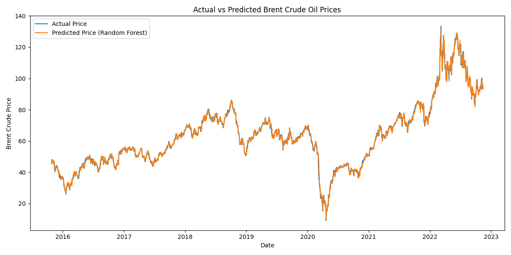

# Crude Oil Price Prediction using Machine Learning (CTRM Use Case)

This project builds a machine learning model to forecast daily Brent crude oil prices using time-series features.  
It demonstrates how ML forecasting supports **Commodity Trading & Risk Management (CTRM)** workflows.

---

## 📁 Dataset
Brent crude daily prices from 1987–2023.

---

## 🧠 Approach
- Data cleaning, sorting, parsing  
- Feature engineering (lag features, rolling mean/volatility)  
- Linear Regression & Random Forest models  
- Time-based train/test split  
- Evaluation using MAE & RMSE  

---

## 📈 Model Output

Below is the **Actual vs Predicted Brent Crude Oil Price** graph:



---

## 📊 Results

**Linear Regression**  
- MAE: 1.067  
- RMSE: 1.613  

**Random Forest Regressor**  
- MAE: 1.171  
- RMSE: 1.744  

---

## 🔧 Tech Stack
Python, Pandas, NumPy, Scikit-Learn, Matplotlib

---

## 🚀 How to Run

```bash
pip install -r requirements.txt
python crude_oil_price_ml.py
```

---

## 📌 CTRM Relevance
This forecasting model helps with:
- Price risk estimation  
- Hedging strategy support  
- Exposure analysis  
- Trading decision support  
